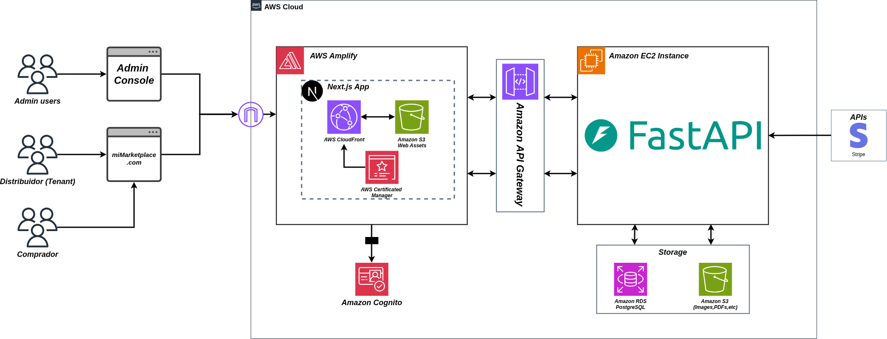

# Waste To Treasure: Circular Marketplace

## MFDS 2025 T2

- **Oscar Alonso Nava Rivera - 214729**
- **Alejandro Campa Alonso - 215833**
- **Arturo Pérez González - 215510**
- **Gabriel Florentino Reyes - 223154**

---

## 🛠️ Herramientas y Documentación

| **Componente** | **Badge** | **Link** |
| :--- | :--- | :--- |
| **Diseño (UI/UX)** |  | *[Figma Waste-to-Treasure](https://www.figma.com/design/veJuTVybl9mTZMvdARzM8Z/Waste_to_Treasure?m=auto&t=iesMHgTVkazcLa90-6)* |
| **Documento SRS** |  | *[SRS Waste-to-Treasure](https://docs.google.com/document/d/1g7tChhs_uoFCBZWRHVa-c5zbZu8bz4nvQMoaRcaqSgo/edit?usp=drive_link)*|
| **Gestión de Proyecto** |  | *[ClickUp Waste-to-Treasure](https://app.clickup.com/9017320099/v/li/901706410258)*|
| **Recursos Generales** |  | *[Google Drive Waste-to-Treasure](https://drive.google.com/drive/folders/1iiecYbVw6VPPth0U2BZyVWx-lx5pBfj-?usp=drive_link)* |
| **Cronograma de actividades** |  | *[Cronograma de actividades Waste-to-Treasure](https://docs.google.com/spreadsheets/d/12olAC_EFbSmpDcZog3AoEN4kJEr4JYcvCsCJ_h2mT7s/edit?usp=drive_link)* |
| **Presentación ejecutiva** |  | *[Presentación ejecutiva Waste-to-Treasure](https://docs.google.com/presentation/d/1fABrxl5PfM4ENgAhuh04vkFjyMu6bVNFOi-9tGhe-0E/edit?usp=drive_link)* |
| **Matriz de riesgos** |  | *[Matriz de riesgos Waste-to-Treasure](https://docs.google.com/spreadsheets/d/1Ell_MC3j9WxbQLUer1Op69W469ZJM3xn/edit?usp=drive_link&ouid=107898318576083024435&rtpof=true&sd=true)* |
| **Despliegue Frontend** |  | *[Despliegue Waste-to-Treasure](https://main.d20d0dqywsvuyq.amplifyapp.com/)* |
| **Despliegue Backend (Docs)** |  | *[Swagger API Docs](http://98.95.79.84:8000/api/v1/docs#/)* |
| **Presentación Final** |  | *[Presentación Final Waste-to-Treasure](https://docs.google.com/presentation/d/1Xm_uwuPdM2kJf2nvExkzZw4Nc1vbr2OllGPx53mZnus/edit?usp=drive_link)* |

---

##  Descripción del Proyecto

**Waste-To-Treasure (W2T)** es una plataforma digital SaaS diseñada para promover la economía circular en zonas industriales como Ciudad Juárez. El objetivo principal es transformar los residuos en recursos valiosos, facilitando la conexión entre dos grupos clave:

1.  **Generadores de Residuos:** Empresas, maquiladoras y **cualquier usuario particular** con excedentes de materiales (madera, metal, textiles, etc.) que desee darles una segunda vida.
2.  **Transformadores Locales:** Artesanos, talleres, emprendedores y personas creativas que requieren materia prima a bajo costo para sus proyectos.

### Funcionalidades Principales
* **Dual Marketplace:** Un espacio unificado donde cualquier usuario puede publicar y adquirir tanto *Materiales* recuperados como *Productos* artesanales terminados.
* **Gestión de Usuarios:** Roles flexibles gestionados vía Amazon Cognito, permitiendo a un mismo usuario actuar como vendedor o comprador según lo necesite.
* **Transacciones Seguras:** Integración completa con **Stripe** para pagos y gestión de comisiones.
* **Suscripciones SaaS:** Planes Free, Pro y Enterprise para vendedores que deseen mayor visibilidad y acceso a métricas avanzadas.
---
##  Arquitectura del Sistema

La plataforma **Waste-To-Treasure** está construida sobre una arquitectura **Cloud-Native** en AWS, diseñada para ser escalable, segura y desacoplada.

### Componentes Principales:

* **Frontend (AWS Amplify):** Alojamiento de la aplicación web **Next.js**. Utiliza **CloudFront** como CDN para una entrega rápida de contenido y **S3** para los assets web estáticos.
* **Authentication (Amazon Cognito):** Gestiona la identidad y el control de acceso de todos los usuarios (Administradores, Vendedores y Compradores), proporcionando seguridad robusta y gestión de sesiones.
* **API Gateway:** Actúa como punto de entrada único y seguro para las peticiones RESTful, enrutando el tráfico desde el cliente hacia el backend.
* **Backend (Amazon EC2 + FastAPI):** La lógica de negocio reside en una instancia EC2 que ejecuta el framework de alto rendimiento **FastAPI (Python)**.
* **Storage Layer:**
    * **Amazon RDS (PostgreSQL):** Base de datos relacional gestionada para datos estructurados (usuarios, transacciones, catálogos).
    * **Amazon S3:** Almacenamiento de objetos para archivos multimedia (imágenes de productos, documentos legales).
* **Integraciones Externas:** Conexión segura con pasarelas de pago como **Stripe** para el procesamiento de transacciones financieras.
